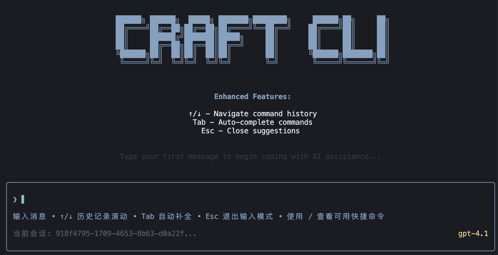

# ByteCraft CLI

一个基于 LangChain 的交互式代码助手 CLI 工具，支持流式输出、工具调用和智能对话。

## 🚀 项目特性

- 🤖 **智能对话** - 基于 DeepSeek 模型的智能代码助手
- 🔄 **流式输出** - 实时流式响应，提供更好的交互体验
- 🛠️ **工具集成** - 支持天气查询等多种工具调用
- ⚙️ **配置管理** - 灵活的 YAML 配置文件系统
- 📝 **类型安全** - 完整的 TypeScript 类型定义
- 🎨 **现代 UI** - 基于 Ink.js 的终端 UI 界面

## 📁 项目结构

```
ByteCraft/
├── src/                          # 源代码目录
│   ├── config/                   # 配置管理模块
│   │   └── config.ts            # 配置文件读取和管理
│   ├── types/                    # 类型定义模块
│   │   ├── index.ts             # 集中类型定义
│   │   └── example.ts           # 类型使用示例
│   ├── utils/                    # 工具和工具函数
│   │   ├── agent/               # AI Agent 相关
│   │   │   └── agent.ts         # 主要的 Agent 实现
│   │   ├── tools/               # 工具集合
│   │   │   └── weather.ts       # 天气查询工具
│   │   ├── logger/              # 日志工具
│   │   └── session/             # 会话管理
│   ├── ui/                      # 用户界面模块
│   │   ├── components/          # UI 组件
│   │   └── hooks/               # React Hooks
│   └── index.ts                 # 应用入口文件
├── config.yaml                  # 主配置文件
├── config.yaml.example          # 配置文件示例
├── tsconfig.json               # TypeScript 配置
├── package.json                # 项目依赖和脚本
└── README.md                   # 项目文档
```

## 🏗️ 模块说明

### 📂 `src/config/` - 配置管理
- **功能**: 管理应用配置，支持 YAML 配置文件
- **主要文件**: `config.ts`
- **特性**:
  - 自动读取 `config.yaml` 文件
  - 类型安全的配置接口
  - 默认配置回退机制
  - 配置验证和错误处理

### 📂 `src/types/` - 类型定义
- **功能**: 集中管理所有 TypeScript 类型定义
- **主要文件**: `index.ts`
- **包含类型**:
  - 配置相关类型 (`AppConfig`, `ModelConfig`)
  - AI/LLM 相关类型 (`ChatMessage`, `ChatResponse`)
  - UI 相关类型 (`UIState`, `ChatUIState`)
  - 工具相关类型 (`FileInfo`, `Result`)

### 📂 `src/utils/agent/` - AI Agent
- **功能**: 核心 AI 助手实现
- **主要文件**: `agent.ts`
- **特性**:
  - 基于 LangChain 的智能对话
  - 流式输出支持
  - 工具调用集成
  - 错误处理和重试机制

### 📂 `src/utils/tools/` - 工具集合
- **功能**: 各种功能工具的实现
- **主要文件**: `weather.ts`
- **当前工具**:
  - **天气查询工具**: 查询指定城市的天气信息
- **扩展性**: 易于添加新工具

### 📂 `src/ui/` - 用户界面
- **功能**: 基于 Ink.js 的终端 UI
- **结构**:
  - `components/`: UI 组件
  - `hooks/`: React Hooks

## ⚙️ 配置说明

### 配置文件 (`config.yaml`)

```yaml
# ByteCraft AI 助手配置
model:
  name: "deepseek-v3-250324"
  baseURL: "https://ark.cn-beijing.volces.com/api/v3"
  apiKey: "your-api-key-here"
  streaming: true
```

### 配置项说明

- `model.name`: AI 模型名称
- `model.baseURL`: API 基础 URL
- `model.apiKey`: API 密钥
- `model.streaming`: 是否启用流式输出

## 🚀 快速开始

### 1. 安装依赖

```bash
pnpm install
```

### 2. 配置 API

复制配置文件示例并填入您的 API 密钥：

```bash
cp config.yaml.example config.yaml
# 编辑 config.yaml，填入您的 API 密钥
```

### 3. 运行应用

```bash
# 开发模式
pnpm dev

# 生产模式
pnpm start

# 构建项目
pnpm build
```

## 🛠️ 开发指南

### 添加新工具

1. 在 `src/utils/tools/` 目录下创建新工具文件
2. 继承 `Tool` 基类并实现 `_call` 方法
3. 在 `agent.ts` 中导入并添加到工具列表

示例：

```typescript
import { Tool } from '@langchain/core/tools';

export class MyTool extends Tool {
  name = 'my_tool';
  description = '工具描述';

  protected async _call(input: string): Promise<string> {
    // 工具实现逻辑
    return '工具结果';
  }
}
```

### 使用类型定义

```typescript
import type { ChatMessage, AppConfig } from '@/types/index.js';

// 使用类型
const message: ChatMessage = {
  role: 'user',
  content: 'Hello',
  timestamp: new Date()
};
```

### 路径映射

项目配置了 TypeScript 路径映射，支持使用 `@` 符号简化导入：

```typescript
// 推荐使用
import { getConfig } from '@/config/config.js';
import type { AppConfig } from '@/types/index.js';

// 而不是相对路径
import { getConfig } from '../../config/config.js';
```

## 📝 脚本说明

- `pnpm start`: 启动应用
- `pnpm dev`: 开发模式（支持热重载）
- `pnpm build`: 构建项目

## 🤝 协作指南

### 代码规范

1. **类型安全**: 所有代码必须使用 TypeScript
2. **路径映射**: 使用 `@` 符号进行导入
3. **错误处理**: 完善的错误处理机制
4. **文档注释**: 重要函数和类需要 JSDoc 注释

### 提交规范

- 使用清晰的提交信息
- 每个功能一个分支
- 提交前运行测试

### 开发流程

1. Fork 项目
2. 创建功能分支
3. 实现功能
4. 添加测试
5. 提交 Pull Request

## 🔧 技术栈

- **语言**: TypeScript
- **运行时**: Node.js
- **AI 框架**: LangChain
- **UI 框架**: Ink.js + React
- **配置管理**: js-yaml
- **包管理**: pnpm

## 📄 许可证

本项目采用 MIT 许可证 - 查看 [LICENSE](LICENSE) 文件了解详情。

## 🤝 贡献

欢迎贡献代码！请查看 [贡献指南](CONTRIBUTING.md) 了解详情。

## 📞 联系方式

如有问题或建议，请通过以下方式联系：

- 提交 Issue
- 发送邮件
- 参与讨论

---

**ByteCraft CLI** - 让代码开发更智能、更高效！ 🚀
