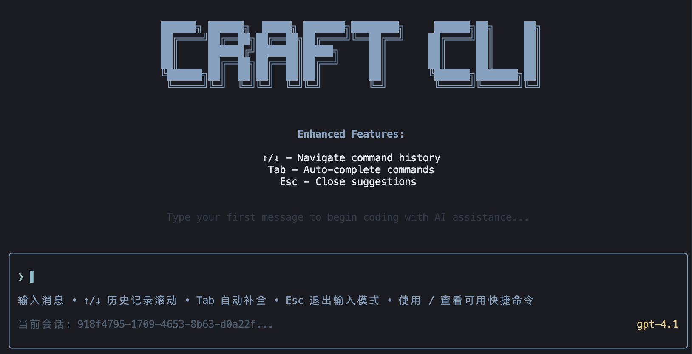

# ByteCraft CLI 开发文档

## 📋 目录

- [项目架构](#项目架构)
- [开发环境设置](#开发环境设置)
- [代码规范](#代码规范)
- [模块开发指南](#模块开发指南)
- [测试指南](#测试指南)
- [部署指南](#部署指南)

## 🏗️ 项目架构

### 整体架构


```
ByteCraft CLI
├── 配置层 (Config Layer)
│   ├── YAML 配置文件
│   └── 配置管理模块
├── 类型层 (Type Layer)
│   └── 集中类型定义
├── 核心层 (Core Layer)
│   ├── AI Agent
│   ├── 工具系统
│   └── 会话管理
├── 界面层 (UI Layer)
│   ├── 终端 UI 组件
│   └── 交互逻辑
└── 工具层 (Tools Layer)
    └── 功能工具集合
```

### 数据流

```
用户输入 → UI层 → Agent → 工具调用 → AI模型 → 流式输出 → UI显示
```

## 🛠️ 开发环境设置

### 环境要求

- Node.js >= 18.0.0
- pnpm >= 8.0.0
- TypeScript >= 5.0.0

### 安装步骤

1. **克隆项目**
   ```bash
   git clone https://github.com/ByteCraftTeam/ByteCraft
   cd ByteCraft
   ```

2. **安装依赖**
   ```bash
   pnpm install
   ```

3. **配置环境**
   ```bash
   cp config.yaml.example config.yaml
   # 编辑 config.yaml 文件
   ```

4. **验证安装**
   ```bash
   pnpm dev
   ```

## 📝 代码规范

### TypeScript 规范

#### 1. 类型定义

- 所有公共接口必须定义类型
- 使用 `interface` 定义对象类型
- 使用 `type` 定义联合类型和工具类型
- 优先使用 `import type` 导入类型

```typescript
// ✅ 正确
import type { AppConfig } from '@/types/index.js';

interface UserConfig {
  name: string;
  email: string;
}

type Status = 'loading' | 'success' | 'error';

// ❌ 错误
const config: any = {};
```

#### 2. 函数定义

- 使用箭头函数定义工具函数
- 使用 `async/await` 处理异步操作
- 添加 JSDoc 注释

```typescript
/**
 * 处理用户配置
 * @param config 用户配置对象
 * @returns 处理后的配置
 */
const processUserConfig = async (config: UserConfig): Promise<ProcessedConfig> => {
  // 实现逻辑
};
```

#### 3. 错误处理

- 使用 `Result<T, E>` 类型处理错误
- 避免使用 `any` 类型
- 提供有意义的错误信息

```typescript
type Result<T, E = Error> = {
  success: true;
  data: T;
} | {
  success: false;
  error: E;
};

const safeOperation = async <T>(operation: () => Promise<T>): Promise<Result<T>> => {
  try {
    const data = await operation();
    return { success: true, data };
  } catch (error) {
    return { success: false, error: error as Error };
  }
};
```

### 文件组织规范

#### 1. 目录结构

```
src/
├── config/          # 配置相关
├── types/           # 类型定义
├── utils/           # 工具函数
│   ├── agent/       # AI Agent
│   ├── tools/       # 功能工具
│   ├── logger/      # 日志工具
│   └── session/     # 会话管理
├── ui/              # 用户界面
│   ├── components/  # UI 组件
│   └── hooks/       # React Hooks
└── index.ts         # 入口文件
```

#### 2. 文件命名

- 使用 kebab-case 命名目录
- 使用 camelCase 命名文件
- 使用 PascalCase 命名类
- 使用 UPPER_SNAKE_CASE 命名常量

```typescript
// 文件名: userConfig.ts
export class UserConfigManager {
  private static readonly DEFAULT_TIMEOUT = 5000;
  
  public async loadConfig(): Promise<void> {
    // 实现逻辑
  }
}
```

### 导入规范

#### 1. 路径映射

优先使用 `@` 路径映射：

```typescript
// ✅ 推荐
import { getConfig } from '@/config/config.js';
import type { AppConfig } from '@/types/index.js';

// ❌ 避免
import { getConfig } from '../../config/config.js';
```

#### 2. 导入顺序

1. 第三方库导入
2. 项目内部导入
3. 类型导入

```typescript
// 第三方库
import { Tool } from '@langchain/core/tools';
import * as fs from 'fs';

// 项目内部
import { getConfig } from '@/config/config.js';

// 类型导入
import type { AppConfig } from '@/types/index.js';
```

## 🔧 模块开发指南

### 配置模块开发

#### 1. 创建配置接口

```typescript
// src/types/index.ts
export interface NewFeatureConfig {
  enabled: boolean;
  timeout: number;
  retries: number;
}

export interface AppConfig {
  model: ModelConfig;
  newFeature: NewFeatureConfig; // 新增配置
}
```

#### 2. 实现配置管理

```typescript
// src/config/config.ts
import type { NewFeatureConfig } from '@/types/index.js';

const defaultConfig: AppConfig = {
  model: { /* ... */ },
  newFeature: {
    enabled: false,
    timeout: 5000,
    retries: 3
  }
};
```

### 工具开发

#### 1. 创建工具类

```typescript
// src/utils/tools/myTool.ts
import { Tool } from '@langchain/core/tools';

export class MyTool extends Tool {
  name = 'my_tool';
  description = '我的工具描述';

  protected async _call(input: string): Promise<string> {
    try {
      // 工具实现逻辑
      const result = await this.processInput(input);
      return `处理结果: ${result}`;
    } catch (error) {
      return `工具执行失败: ${error instanceof Error ? error.message : '未知错误'}`;
    }
  }

  private async processInput(input: string): Promise<string> {
    // 具体处理逻辑
    return input.toUpperCase();
  }
}
```

#### 2. 集成到 Agent

```typescript
// src/utils/agent/agent.ts
import { createMyTool } from '@/utils/tools/myTool.js';

const tools = [
  createWeatherTool(),
  createMyTool() // 添加新工具
];
```

### UI 组件开发

#### 1. 创建组件

```typescript
// src/ui/components/MyComponent.tsx
import React from 'react';
import { Box, Text } from 'ink';

interface MyComponentProps {
  title: string;
  content: string;
}

export const MyComponent: React.FC<MyComponentProps> = ({ title, content }) => {
  return (
    <Box flexDirection="column">
      <Text bold>{title}</Text>
      <Text>{content}</Text>
    </Box>
  );
};
```

#### 2. 创建 Hook

```typescript
// src/ui/hooks/useMyHook.ts
import { useState, useEffect } from 'react';

export const useMyHook = (initialValue: string) => {
  const [value, setValue] = useState(initialValue);
  const [isLoading, setIsLoading] = useState(false);

  useEffect(() => {
    // Hook 逻辑
  }, [value]);

  return { value, setValue, isLoading };
};
```

## 🧪 测试指南

### 单元测试

#### 1. 测试工具

```typescript
// tests/utils/tools/weather.test.ts
import { describe, it, expect } from 'vitest';
import { WeatherTool } from '@/utils/tools/weather.js';

describe('WeatherTool', () => {
  it('should return weather info for valid city', async () => {
    const tool = new WeatherTool();
    const result = await tool.call('杭州');
    
    expect(result).toContain('杭州');
    expect(result).toContain('天气');
  });

  it('should handle empty input', async () => {
    const tool = new WeatherTool();
    const result = await tool.call('');
    
    expect(result).toContain('请提供城市名称');
  });
});
```

#### 2. 测试配置

```typescript
// tests/config/config.test.ts
import { describe, it, expect } from 'vitest';
import { loadConfig } from '@/config/config.js';

describe('Config', () => {
  it('should load default config when file not exists', () => {
    const config = loadConfig();
    expect(config.model.name).toBeDefined();
  });
});
```

### 集成测试

```typescript
// tests/integration/agent.test.ts
import { describe, it, expect } from 'vitest';
import { runAgent } from '@/utils/agent/agent.js';

describe('Agent Integration', () => {
  it('should handle weather query', async () => {
    const response = await runAgent('查询杭州天气');
    expect(response).toContain('杭州');
  });
});
```

## 🚀 部署指南

### 开发环境

```bash
# 开发模式
pnpm dev

# 构建
pnpm build

# 运行构建后的代码
node dist/index.js
```

### 生产环境

```bash
# 安装生产依赖
pnpm install --production

# 构建项目
pnpm build

# 启动应用
pnpm start
```

### Docker 部署

```dockerfile
# Dockerfile
FROM node:18-alpine

WORKDIR /app

COPY package.json pnpm-lock.yaml ./
RUN npm install -g pnpm && pnpm install --production

COPY . .
RUN pnpm build

EXPOSE 3000

CMD ["pnpm", "start"]
```

## 📚 最佳实践

### 1. 错误处理

- 使用 `Result` 类型处理错误
- 提供有意义的错误信息
- 记录错误日志

### 2. 性能优化

- 使用流式输出减少延迟
- 缓存配置和会话数据
- 避免不必要的 API 调用

### 3. 安全性

- 不要在代码中硬编码 API 密钥
- 验证用户输入
- 使用环境变量存储敏感信息

### 4. 可维护性

- 编写清晰的文档
- 使用类型定义
- 遵循单一职责原则

## 🔍 调试指南

### 1. 日志调试

```typescript
import { logger } from '@/utils/logger/index.js';

logger.debug('调试信息', { data: 'value' });
logger.info('信息日志');
logger.error('错误日志', error);
```

### 2. 开发工具

- 使用 VS Code 的 TypeScript 支持
- 启用 ESLint 和 Prettier
- 使用断点调试

### 3. 常见问题

#### 路径映射不工作

检查 `tsconfig.json` 中的路径配置：

```json
{
  "compilerOptions": {
    "baseUrl": ".",
    "paths": {
      "@/*": ["src/*"]
    }
  }
}
```

#### 工具不工作

检查工具是否正确继承 `Tool` 类：

```typescript
export class MyTool extends Tool {
  // 必须实现 _call 方法
  protected async _call(input: string): Promise<string> {
    // 实现逻辑
  }
}
```

## 📞 获取帮助

- 查看 [README.md](../README.md)
- 提交 [Issue](../../issues)
- 参与 [讨论](../../discussions)

---

**Happy Coding!** 🎉